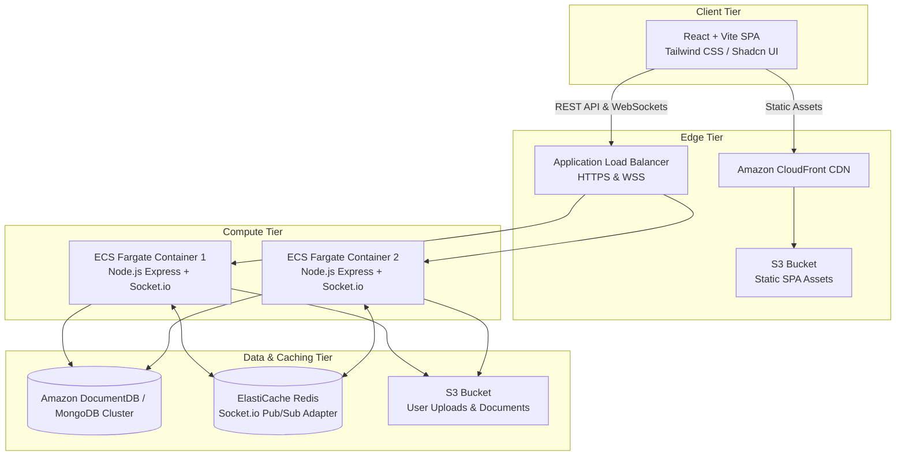
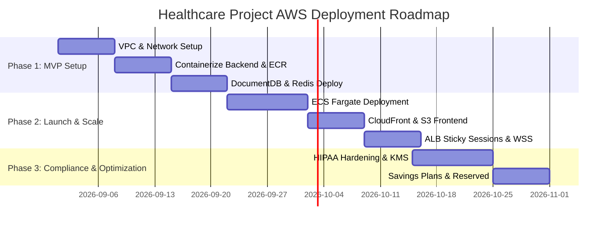

# Healthcare Project: Comprehensive Discovery Report & AWS Cost Estimation

This document presents a complete technical discovery analysis of the **Healthcare Project** codebase (located locally at `c:\HealthcareProject`), along with a detailed AWS cloud architecture cost model, service breakdown, compliance considerations, and a phased execution roadmap.

---

## 1. Structured Project Detail Report

### 1.1 Objectives & Vision
The **Healthcare Support Platform** is a full-stack digital telehealth and medical advisory application designed to bridge patients and medical professionals. Key business objectives include:
- **Patient Empowerment**: Enabling patients to ask medical questions, find specialized healthcare providers, and book appointments seamlessly.
- **Doctor Promotion & Engagement**: Providing doctors with digital profiles, promotion tools via paid tiers, and publication platforms for health blogs.
- **Real-Time Telehealth Chat**: Providing encrypted real-time consultation messaging between patients and practitioners.
- **Monetization & Moderation**: Administrative governance with Stripe-backed payment processing for doctor promotions and premium consultation services.

### 1.2 Key Deliverables
- **Frontend Single Page Application (SPA)**: Built with React 18, Vite, TypeScript, Tailwind CSS, Shadcn UI, Leaflet (interactive maps), Recharts (visual data), and Socket.io-client. Located in [`c:\HealthcareProject\healthcaresupport`](file:///c:/HealthcareProject/healthcaresupport).
- **Backend API & Real-time WebSockets Server**: Node.js + Express REST API with TypeScript, Socket.io event engine, JWT authentication, and Stripe payment integration. Located in [`c:\HealthcareProject\server`](file:///c:/HealthcareProject/server).
- **Database Schema**: MongoDB document database modeled via Mongoose ODM for multi-entity relationship management.
- **Role-Based Portals**: Customized interfaces for Patients, Doctors, and System Administrators.

### 1.3 System Components & Subsystems

| Component | Technology / File Path | Functional Responsibility |
| :--- | :--- | :--- |
| **Authentication & Auth** | [`authController.ts`](file:///c:/HealthcareProject/server/controllers/authController.ts) | User registration, login, JWT issuance, password resets, role-based protection. |
| **Doctor Directory & Search** | [`doctorController.ts`](file:///c:/HealthcareProject/server/controllers/doctorController.ts) | Specialty lookup, geographic location search with Leaflet, doctor reviews, profiles. |
| **Q&A Engine** | [`questionController.ts`](file:///c:/HealthcareProject/server/controllers/questionController.ts) | Public/private medical questions, doctor response workflows, resolution tracking. |
| **Real-time Telehealth Chat** | [`chatHandler.ts`](file:///c:/HealthcareProject/server/socket/chatHandler.ts) | Socket.io WebSocket rooms for messaging between patient and doctor. |
| **Appointment System** | [`appointmentController.ts`](file:///c:/HealthcareProject/server/controllers/appointmentController.ts) | Booking slots, status updates (pending, confirmed, completed, cancelled). |
| **Health Blog & CMS** | [`blogController.ts`](file:///c:/HealthcareProject/server/controllers/blogController.ts) | Tiptap rich-text publishing, doctor/author submissions, admin moderation. |
| **Payment Engine** | [`paymentController.ts`](file:///c:/HealthcareProject/server/controllers/paymentController.ts) | Stripe API payments for doctor profile promotions and consultation packages. |
| **SEO & Metadata** | [`seoController.ts`](file:///c:/HealthcareProject/server/controllers/seoController.ts) | Dynamic SEO metadata, open graph tags, canonical links per page/route. |
| **Admin Portal** | [`adminController.ts`](file:///c:/HealthcareProject/server/controllers/adminController.ts) | User management, doctor verification approvals, payment audit logs, system stats. |

### 1.4 Technical Architecture & Data Flow



### 1.5 Data Sources & Database Entities
The application utilizes 12 primary database collections managed via Mongoose models in [`c:\HealthcareProject\server\models`](file:///c:/HealthcareProject/server/models):
1. **User**: Authentication, roles (`patient`, `doctor`, `admin`), profile data.
2. **DoctorProfile**: Specialization, bio, experience, consultation fees, clinic address, geo coordinates.
3. **Question**: Medical queries, tags, category, responses array from verified doctors.
4. **Appointment**: Patient ID, Doctor ID, date, time slot, status, consultation notes.
5. **Message**: Sender ID, Receiver ID, chat content, timestamp, read status.
6. **Blog & BlogSubmission**: Article body, category, author reference, approval status.
7. **BlogAuthor**: Bio, credentials, profile photo.
8. **PaymentOrder**: Stripe payment intents, user ID, amount (cents), status, metadata.
9. **Review**: Rating (1-5 stars), patient comments, doctor ID.
10. **Specialty**: Medical categories (e.g., Cardiology, Dermatology, Pediatrics).
11. **SeoMeta**: Page routes, title, meta description, keywords.

### 1.6 Technology Stack & Dependencies

```
+-----------------------------------------------------------------------+
|                           FRONTEND STACK                              |
| React 18 | Vite | TypeScript | Redux Toolkit | TanStack React Query  |
| Tailwind CSS | Shadcn UI | Leaflet Maps | Recharts | Socket.io-client  |
+-----------------------------------------------------------------------+
                                   |
                                REST API / WebSockets
                                   v
+-----------------------------------------------------------------------+
|                           BACKEND STACK                               |
| Node.js | Express.js | TypeScript | Mongoose ODM | Socket.io          |
| JWT Auth | Bcrypt.js | Joi Validator | Stripe SDK | Nodemailer        |
+-----------------------------------------------------------------------+
                                   |
                                   v
+-----------------------------------------------------------------------+
|                         DATABASE & CLOUD                              |
| MongoDB / Amazon DocumentDB | ElastiCache Redis | Amazon S3 / CDN     |
+-----------------------------------------------------------------------+
```

### 1.7 Resource Requirements
- **Engineering Team**: 1 Frontend Engineer, 1 Node.js/Backend Engineer, 1 DevOps / AWS Infrastructure Specialist, 1 QA Engineer.
- **Design & Security**: UI/UX Designer, HIPAA Security Officer / Compliance Lead.

### 1.8 Estimated Implementation Timeline
- **Phase 1: Foundation & Infrastructure Provisioning** (Weeks 1–3): AWS VPC, ECS, DocumentDB setup, CI/CD pipeline establishment.
- **Phase 2: Core Feature Deployment & WebSockets** (Weeks 4–7): Backend containerization, frontend S3/CloudFront build, Redis adapter integration.
- **Phase 3: Security, Compliance & Load Testing** (Weeks 8–10): SSL/TLS 1.3, HIPAA BAA configuration, AWS WAF rules, performance benchmarks.
- **Phase 4: Production Launch & Monitoring** (Weeks 11–12): Domain cutover, CloudWatch alarms, operational handover.

### 1.9 Project Constraints & Risks
- **HIPAA Compliance**: PHI (Protected Health Information) in chat messages and medical questions requires encryption in transit (TLS 1.3) and at rest (AWS KMS AES-256), along with AWS BAA execution.
- **Socket.io Statefulness**: Horizontal scaling across multiple ECS Fargate tasks requires an ElastiCache Redis Pub/Sub adapter and ALB sticky sessions.
- **Stripe Webhook Reliability**: Webhook idempotency and secure signature verification for payment status sync.

---

## 2. AWS Architecture & Cost Estimation Parameters

### 2.1 Key Assumptions
- **Region**: `us-east-1` (US East - N. Virginia) for standard, cost-efficient baseline pricing.
- **Target Uptime**: 99.9% availability across Multi-AZ deployment.
- **Traffic Profile (MVP / Moderate Scale)**:
  - **Active Users**: ~10,000 Monthly Active Users (MAU).
  - **API Requests**: ~50,000 requests/day (~1.5 million requests/month).
  - **Concurrent WebSockets**: Up to 200 peak concurrent socket connections.
  - **Data Volume**: 50 GB image/document storage in S3; 20 GB database storage in DocumentDB.
  - **Data Transfer**: 150 GB/month egress data transfer.
- **Includes**: CI/CD (ECR + Build), CloudWatch monitoring/logging, AWS WAF security, daily automated database backups, and HIPAA compliance readiness.

---

## 3. Explicit AWS Service Breakdown & Cost Estimates

### 3.1 Line-Item Cost Breakdown (Monthly View)

| Service | Architecture Role / Specifications | Unit Cost / Metrics | Monthly Usage | Monthly Cost (USD) |
| :--- | :--- | :--- | :--- | :--- |
| **AWS ECS Fargate** | Backend Node.js REST & WebSockets server (2 Tasks for Multi-AZ) | $0.04048 / vCPU-hr<br>$0.004445 / GB-hr | 2 Tasks (0.5 vCPU, 1 GB RAM each) = 730 hrs x 2 | **$36.10** |
| **Amazon S3** | Static Website Hosting & User Uploads (Medical Images/Avatars) | $0.023 / GB-mo<br>$0.005 / 1k PUT<br>$0.0004 / 1k GET | 50 GB Storage<br>20,000 PUT<br>200,000 GET | **$1.35** |
| **Amazon CloudFront** | CDN for global static asset delivery & SSL termination | $0.085 / GB Out<br>First 1TB free | 100 GB Data Out (Free Tier covered or minimal) | **$0.00** |
| **Amazon DocumentDB** | Managed MongoDB-compatible database (Multi-AZ Cluster) | $0.078 / hr (db.t3.medium)<br>$0.10 / GB storage | 1 Primary + 1 Replica (db.t3.medium)<br>20 GB Data + 20 GB Backup | **$115.88** |
| **Amazon ElastiCache** | Redis cluster for Socket.io state adapter & session caching | $0.017 / hr (cache.t4g.micro) | 1 Node (cache.t4g.micro running 730 hrs) | **$12.41** |
| **AWS ALB** | Application Load Balancer (HTTP/2, WebSockets, WSS) | $0.0225 / ALB-hr<br>$0.008 / LCU-hr | 1 ALB (730 hrs)<br>1.5 LCU average | **$25.10** |
| **AWS NAT Gateway** | Subnet egress for private Fargate & DocumentDB tasks | $0.045 / hr<br>$0.045 / GB processed | 1 NAT Gateway (730 hrs)<br>50 GB processed | **$35.10** |
| **AWS ECR** | Docker Container Image Repository | $0.10 / GB-month | 5 GB image storage | **$0.50** |
| **AWS CloudWatch** | Logs, Custom Metrics, Dashboard & Alarms | $0.50 / GB ingested<br>$0.10 / alarm | 15 GB Log Ingestion<br>5 Alarms | **$8.00** |
| **AWS WAF** | Web Application Firewall protecting ALB | $5.00 / WebACL-mo<br>$1.00 / rule-mo<br>$0.60 / 1M req | 1 WebACL<br>3 Rules (Rate Limit, SQLi, Core)<br>1.5M Requests | **$8.90** |
| **AWS KMS** | Key Management for HIPAA Compliant Disk/Data Encryption | $1.00 / KMS Key-mo | 2 Customer Managed Keys | **$2.00** |
| **Data Transfer Out** | Egress traffic to Internet | $0.09 / GB (beyond 100GB free) | 50 GB paid egress | **$4.50** |
| **TOTAL ESTIMATED MONTHLY COST** | | | | **$249.84** |

---

### 3.2 Monthly vs. Annual View

| Pricing Model | Monthly Cost | Annual Cost | Notes & Savings Opportunity |
| :--- | :--- | :--- | :--- |
| **On-Demand Pricing** | **$249.84** | **$2,998.08** | Full flexibility with zero upfront commitment. Ideal for MVP phase. |
| **1-Year Compute Savings Plan** | **$212.00** | **$2,544.00** | ~15% savings on ECS Fargate compute commitment. |
| **1-Year DocumentDB Reserved Instance** | **$185.00** | **$2,220.00** | ~26% savings by reserving DocumentDB `db.t3.medium` instances. |

> [!NOTE]
> Prices reflect standard `us-east-1` AWS public rates as of 2026. Data transfer and compute numbers are based on the baseline 10,000 MAU profile.

---

## 4. Phased Implementation & Cost Optimization Plan



### 4.1 Phase 1: MVP Validation & Baseline Infrastructure
- Deploy single-AZ MongoDB baseline on AWS EC2 or MongoDB Atlas Free/Shared Tier to minimize initial sandbox costs (~$0 - $30/mo).
- Host frontend on S3 + CloudFront with standard SSL certificate via AWS Certificate Manager (ACM).
- Run server backend on a single low-cost ECS Fargate task or EC2 `t4g.small` instance.

### 4.2 Phase 2: Scalable Production Deployment
- Upgrade database to multi-AZ Amazon DocumentDB or MongoDB Atlas Dedicated Cluster.
- Add ElastiCache Redis for Socket.io adapter to support multi-container WebSocket broadcast.
- Enable AWS WAF on the ALB to protect against OWASP Top 10 vulnerabilities (SQLi, XSS, rate-limiting).

### 4.3 Phase 3: Cost Optimization & Compliance Strategy
1. **Savings Plans & Reserved Instances**: Commit to 1-year Fargate Savings Plans and DocumentDB Reserved Instances to reduce annual cloud spend by up to 30%.
2. **NAT Gateway Optimization**: Replace NAT Gateways with VPC Endpoints (S3, ECR, CloudWatch) to eliminate per-GB data processing fees.
3. **S3 Storage Lifecycle Policies**: Move older patient logs and blog upload backups to S3 Glacier Flexible Retrieval after 90 days.
4. **Auto-Scaling Rules**: Configure Fargate target tracking auto-scaling based on CPU (70%) and active WebSocket connections.

---

## 5. Summary of Assumptions & Confirmation Checklist

- [x] **Project Repository Location**: Monorepo stored locally at `c:\HealthcareProject` (`healthcaresupport` frontend, `server` backend).
- [x] **Traffic & Scale Target**: Assumed baseline 10,000 MAU, 50k requests/day, 200 concurrent WebSockets, 50 GB storage.
- [x] **AWS Region & Compliance**: Region `us-east-1`; architecture structured for HIPAA compliance readiness (KMS encryption, CloudTrail audit logs, private subnets).
- [x] **DevOps & DR Scope**: Includes ECR container registry, CloudWatch logging/monitoring, multi-AZ database replication, and ALB WAF security.
